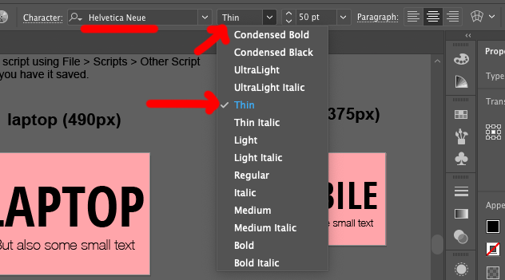

# Fixing text/font issues on ai2html exports

## Using ai2html-config.json to specify fonts

Sometimes when you're working on a graphic with [ai2html](http://ai2html.org), your exported graphic might have issues with text.

For example, **this one has text that runs off the side of the page:**


You might think it's a problem with your graphic, but **it's usually a problem with your fonts**. This is most obvious when you're using really cool hip fonts and they won't show up after you've exported.

Let's say we've got a sweet combination of **Open Sans Condensed** and a very thin version of **Lato**.


When you go to export using ai2html, you're going to get yelled at in the text box popup: **Missing a rule for converting font.**


Illustrator/ai2html will then **list the fonts that it didn't understand.** In this case, they were `OpenSansCondensed-Bold` and `HelveticaNeue-Thin`. 

In addition, **if you open up the ai2html export**, your fonts just plain won't work:


Looks terrible!

**To fix this,** we need to create a new file called `ai2html-config.json`. It has JSON inside that explains the fonts you're using.


You'll need to list each and every font you use that Illustrator didn't understand (I think by default it only knows Arial and Georgia). My `ai2html-config.json` file looks like this:

```json
{	
	"fonts": [
        {
            "aifont": "OpenSans-CondensedBold",
            "family": "Open Sans Condensed",
            "weight": "700",
            "style": ""
        },
        {
            "aifont": "HelveticaNeue-Thin",
            "family": "Helvetica Neue",
            "weight": "200",
            "style": ""
        },
    ]
}
```

**Toe xplain the options:** 

* `aifont` is the name the Illustrator popup uses
* `family` is the name of the font
* `weight` describe how bold the font is
* I have no idea what `style` does.

[You can see a reference here about weight](https://developer.mozilla.org/en-US/docs/Web/CSS/font-weight), but it's basically 400 is normal, 700 is bold, and 100-300 are various thinner variants.  Helvetica Neue has UltraLight, Thin, and Ultra Thin versions, so I figured 200 should be about right for the Thin version.



You'll want to make sure your `ai2html-config.json` file is in **the same folder as your `.ai` file.


Now that you've explained what all of the fonts are, when you run the ai2html script it'll be like magic! **No errors!**


If you have errors, go back and double-check your JSON file.

Once we have no errors about fonts when running the script, open up the HTML. The fonts should look good, and **life will be perfect!**


...well, most of the time, anyway. Read the next section to learn about web fonts!

## Using web fonts

Even if _you_ have a font installed on your computer, **it doesn't mean everyone else does.** For more "rare" fonts that don't typically come preinstalled, we need to somehow load it onto our website!

You'll probably want to go to [Google Fonts](https://fonts.google.com/) and find it there. If it isn't there... you should probably just switch to a different font, really!

In case example below, we're looking for `Open Sans` in both normal weight and bold.


Once you've made your selection, open up your final HTML (not the ai2html export) and **add in the embed code that Google Fonts gives you.** This piece of code allows a new font to be used on the page, a font that isn't actually installed on your computer.


Refresh, and you'll be all set! Or, I guess, upload it onto the internet, use a computer without the font, refresh, and you'll be all set!

> If you want to put up a font that isn't available as a web font, it's [_technically possibile_](https://www.fontsquirrel.com/tools/webfont-generator) but it usually violates the license you're using the font under.
