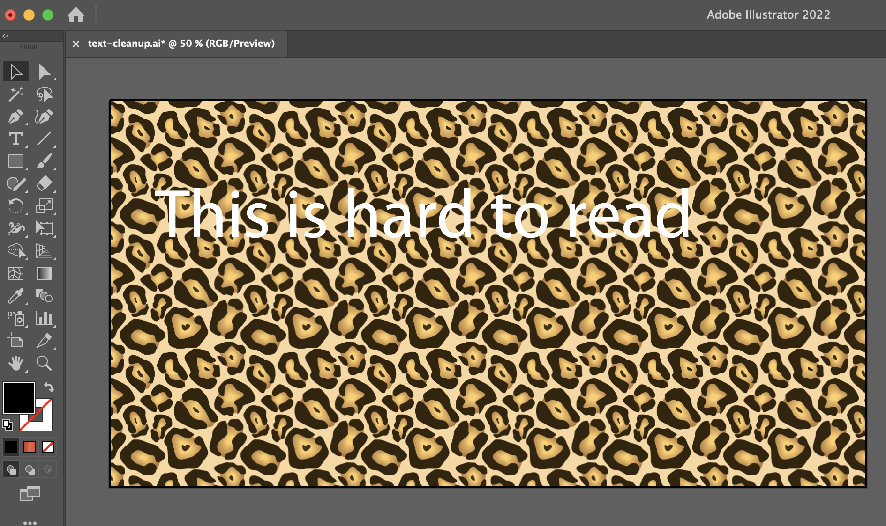
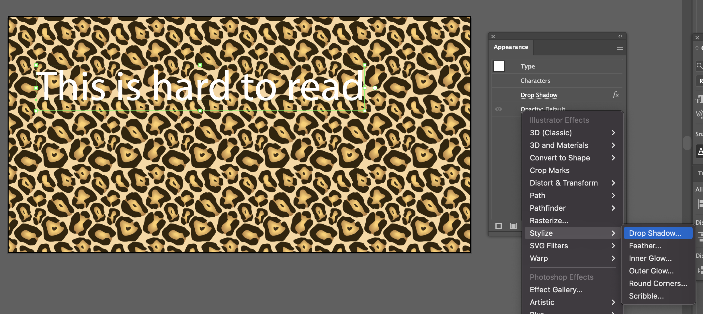
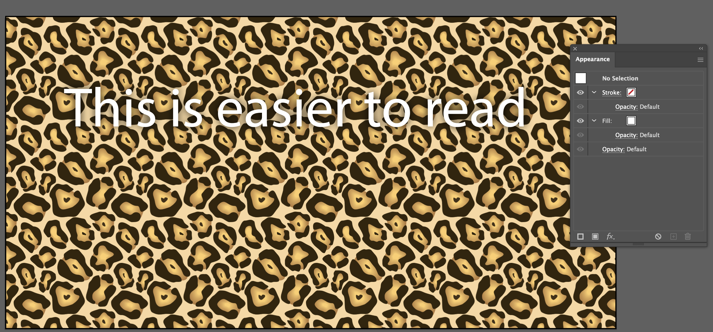
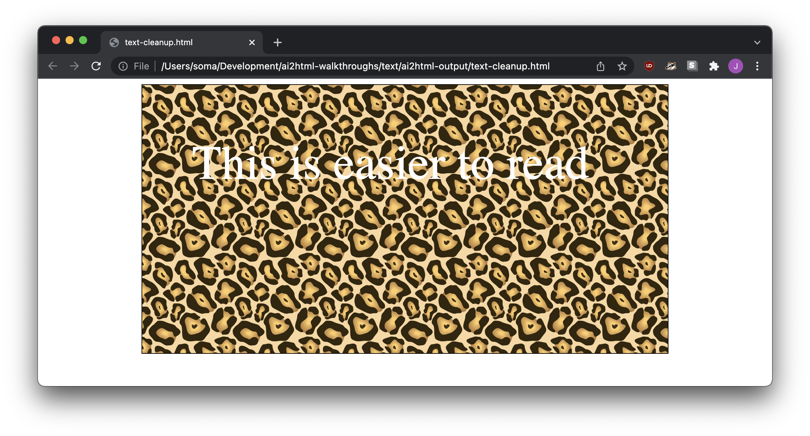
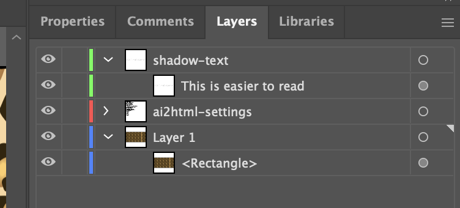
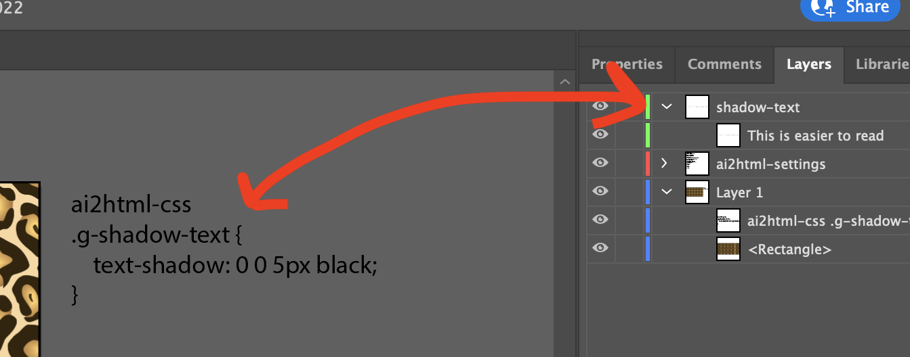
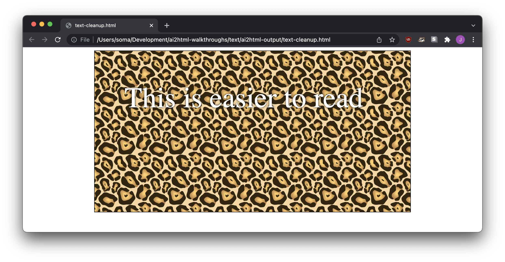

# Adding shadows and glow effects to text in ai2html

Whether you're highlighting some text for a map or making a headline pop, adding shadows and glow effects is a little bit of an uphill battle.

## The problem/solution in Illustrator

When you're confronted with text that's on a tough-to-read background in Illustrator, you might add a text shadow to help it stand out from the background.



Open the "Appearance" window by going to `Windows > Appearance`, select your text, click the `fx` button on the Appearance window, and then apply `Stylize > Drop Shadow`. I like to keep the offset at zero, set opacity to 100%, and then apply a little bit of a blur effect.



It'll look fine on your artboard, but that's only half the battle!



## The problem: ai2html doesn't work!

Effects are fun in Illustrator and can be exported as *images*, but they don't come through when we export with ai2html.



## The solution: custom CSS

If we edited the CSS of the web page, we could add `text-shadow: 0 0 5px black` to the text. Doing that with ai2html is a little more complicated!

### Step 1: Create a new layer

Create a new layer and move the text to it. Name the layer something meaningful without spaces - mine is `shadow-text`.



### Step 2: Add an `ai2html-css` text block

Use the text tool to create a new block of text *outside of your artboard*, and write some custom CSS with the line `ai2html-css` above it.

```
ai2html-css
.g-shadow-text {
    text-shadow: 0 0 5px black;
}
```

Your custom CSS will match your layer name, but with `.g-` in front of it. My layer is `shadow-text` so my rule is about `.g-shadow-text`.



Don't worry about ruining your graphic – this content won't show up on the exported image because it's off of the artboard.

### Step 3: Export again!

When you run ai2html to export again, ai2html will automatically add the class `g-text-shadow` to the `text-shadow` layer, and also add the custom CSS to the page.

Take a look at your page – the shadow magically appears!



You'll need to tweak your CSS a bit to reproduce the look you have in Illustrator, and you'll have to [stack text-shadow effects to get glowing text](https://www.w3schools.com/csSref/css3_pr_text-shadow.asp), but you're definitely on your way!